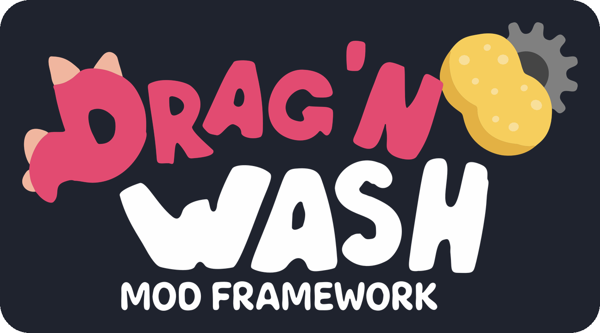

<p align="center"><picture><source media="(prefers-color-scheme: dark)" srcset="images/logo-notagames.png"></picture></p>

# Drag'n Wash ModFramework

[English](README.md)

[Drag'n Wash](https://store.steampowered.com/app/4739660/) 用の前提 Mod（BepInEx 5）です。ゲームに入り込むコードを 1 か所にまとめた小さな中核で、ほかの Mod や、その上に乗るライブラリ（前提 Mod の上の前提 Mod）が使える安定した API を用意しています。

- ゲームの Options 画面から開く Mods 画面（Minecraft Forge の Mod 一覧みたいなもので、Mod のオン・オフもできます）
- ゲームの Options 画面に設定を足す
- テキストや会話のイベント
- Direct3D 12 でも安全なアセットの読み込み
- など

なので、ゲームがアップデートされても、合わせて直すのはフレームワークだけで済みます。

> [!NOTE]
> 最新のリリースは **1.6.0** です。バージョンごとに何が変わったかは下の[リリース](#リリース)に、細かいところまで全部は [CHANGELOG.md](CHANGELOG.md) に書いてあります。この先の予定は [docs/ROADMAP.ja.md](docs/ROADMAP.ja.md) にあります。

## どこを読むか

| 知りたいこと | 読むところ |
|---|---|
| Mod を入れて遊ぶ、はじめての Mod、ライブラリを調べる | [Wiki](https://github.com/TomXV/dragnwash-modframework/wiki/Home-ja)：プレイヤー向けのページ、はじめての Mod の手順、ライブラリごとのリファレンス |
| この上で Mod を作る | [Playing well with others (wiki)](https://github.com/TomXV/dragnwash-modframework/wiki/Playing-well-with-others-ja) |
| 目標と作業の順番 | [docs/DESIGN.ja.md](docs/DESIGN.ja.md) |
| 確認したゲームのビルド | [docs/GAME_BUILDS.md](docs/GAME_BUILDS.md) |

## 中身

| プラグイン | GUID | Mod が使えるもの |
|---|---|---|
| **Drag'n Wash ModFramework**（中核） | `com.tomxv.dragnwash.modframework` | オン・オフ、設定ページ、アイコン付きの Mods 画面（`ModFramework.Register`）、ゲームの Options 画面への行の追加（`GameOptions`）、サービスの登録（`Services`）、動作チェック（`GameHooks`）、`GameInfo` |
| **Text** | `com.tomxv.dragnwash.modframework.text` | ゲームが表示する前のテキストを見て置き換える（`GameText`） |
| **Dialogue** | `com.tomxv.dragnwash.modframework.dialogue` | これから表示される台詞や選択肢を、台詞 ID・話者・ノードつきで受け取る（`GameDialogue`） |
| **Tool window** | `com.tomxv.dragnwash.modframework.toolwindow` | 開発ツール用の共通の F1 ウィンドウ（Options → Mods の「Developer tools」をオンにするまで開かない）に、Mod ごとにタブを足す（`ToolWindow`） |
| **Assets** | `com.tomxv.dragnwash.modframework.assets` | どの言語でも表示できるフォント、テクスチャとアセットバンドルの読み込みを、Direct3D 12 でクラッシュさせずに行う（`GameFonts`、`GameAssets`） |
| **Flags and saves** | `com.tomxv.dragnwash.modframework.saves` | セーブスロット、フラグ、すべてのセーブの履歴（`GameSaves`、`GameFlags`） |
| **Inspector**（実験的） | `com.tomxv.dragnwash.modframework.inspector` | F1 の窓の Inspector タブ。読み込まれているシーンとオブジェクト、そのコンポーネントと値、ゲームのコード、読み込まれているものすべてを種類別に（[Inspector](https://github.com/TomXV/dragnwash-modframework/wiki/Inspector-ja)） |
| **Overrides**（実験的） | `com.tomxv.dragnwash.modframework.overrides` | コードのない Mod を動かします。Inspector で作った、ゲームの値を書き換えるだけのフォルダーです（[Overrides](https://github.com/TomXV/dragnwash-modframework/wiki/Overrides-ja)） |
| **Bridge**（実験的） | `com.tomxv.dragnwash.modframework.bridge` | この PC の AI クライアントに読み取り操作を MCP で渡し、コードのグラフのページを出します。既定はオフ（[Bridge](https://github.com/TomXV/dragnwash-modframework/wiki/Bridge-ja)） |
| **Graphs**（実験的） | `com.tomxv.dragnwash.modframework.graphs` | 何かを「する」コードのない Mod を動かします。*これが起きたら、これをする*。作るのは Bridge のページです（[Graphs](https://github.com/TomXV/dragnwash-modframework/wiki/Graphs-ja)） |

ライブラリはそれぞれ別のプラグインで、バージョンも別々です。使っている Mod に要るものを入れてください。バージョンは [CHANGELOG.md](CHANGELOG.md) で確かめられます。

### 更新のお知らせ

中核 1.1.0 から、入れている Mod に新しいリリースが出ていると、Mods 画面とタイトル画面で知らせてくれます。

確かめるのは GitHub のリポジトリを指定している Mod だけで、どれも 1 日に 1 回までです。GitHub の公開 API（`api.github.com`）にリポジトリの最新リリースを聞くだけで、あなたのことやゲーム、ほかの Mod のことは何も送りません。ただ、どの Web ページを開くときもそうですが、GitHub 側には IP アドレスが見えます。

ダウンロードやインストールはしません。Mods 画面からリリースページを開けるだけです。

止めたいときは、**Options → Mods → Drag'n Wash ModFramework → Settings** で **Check for updates** を Off にするか、`BepInEx/config/com.tomxv.dragnwash.modframework.cfg` で `Check for updates = false` にしてください。

## リリース

1.0.0 からは、公開 API の互換性を壊す変更は、メジャーバージョンを上げるときにしか入れません。変更は全部 [CHANGELOG.md](CHANGELOG.md) にあります。

- **1.6.0**：ゲームの前に動くランチャーが入りました。`Launcher.exe` が Steam の起動オプションから動いて、遊ぶ前に Mod を最新にします。Mods 画面の **更新する** でも、ゲームの中から同じことができます。インストーラーの窓もランチャーに合わせて作り直し、macOS でも F1 の窓の文字が出るようになりました。
- **1.5.0**：見た目がまるごと新しくなりました。Mods 画面はすりガラスの上に作り直し、F1 のウィンドウはタブを 1 つずつ見直しました。起動も速くなり、インストーラーは ModFramework を専用のリリースから取ってくるようになりました。1.5.0 からは、中核と全部のライブラリが同じバージョン番号になります。
- **1.4.3**：Bridge タブに **Open page** と **Graphs** のボタンが付いて、エディターがひと押しで開けるようになりました。
- **1.4.2**：キーに反応するグラフが、同じキーを使っているほかの Mod の名前も出すようになりました（`ModFramework.WhoElseUses`）。
- **1.4.1**：**[Graphs](https://github.com/TomXV/dragnwash-modframework/wiki/Graphs-ja)** 0.1.0 が入りました。何かを「する」、コードのない Mod です（*これが起きたら、これをする*）。一緒に入ったのは次のものです。
  - 最初の書き込み操作
  - Bridge のページのブロックとノードのエディター
  - グラフが何を変えるかの Mods 画面での表示、止めたときの巻き戻し、2 つの Mod が同じ値を変えたときの知らせ

  中核と preloader パッチャーは 1.4.1、Overrides は 0.1.1、Bridge は 0.1.1、Inspector は 1.1.1 になりました。Inspector の History には、ほかの Mod が変えたものも並ぶようになっています。
- **1.4.0**：
  - コードのない Mod（[Overrides](https://github.com/TomXV/dragnwash-modframework/wiki/Overrides-ja)：Inspector で作った、値を書き換えるだけのフォルダー）
  - 各ライブラリができることを登録する[操作の登録簿](https://github.com/TomXV/dragnwash-modframework/wiki/Operations-ja)
  - その読み取り操作を MCP でこの PC の AI クライアントに渡す [Bridge](https://github.com/TomXV/dragnwash-modframework/wiki/Bridge-ja)
  - [コードのグラフ](https://github.com/TomXV/dragnwash-modframework/wiki/Code-graph-ja)
  - [Inspector](https://github.com/TomXV/dragnwash-modframework/wiki/Inspector-ja) のオブジェクトエクスプローラー・Animator・Rigidbody・シーンとレベル

  中核と preloader パッチャーが 1.4.0、Tool window と Dialogue が 1.2.0、Text・Flags and saves・Inspector が 1.1.0、Assets が 1.2.0 になりました。新しく入ったものは、どれも実験的な扱いです。
- **1.3.0**：
  - 何が起きたかをゲームの外のウィンドウで知らせる[クラッシュレポート](https://github.com/TomXV/dragnwash-modframework/wiki/Crash-reports-ja)
  - それで突き止めた Direct3D 12 のクラッシュの修正（フォントのアトラスの転送を 1 フレームに 1 回に）
  - `GameOptions.AddSlider`

  Tool window と Assets は 1.1.1 になりました。
- **1.2.1**：2026 年 9 月 14 日のゲームのアップデート以降に作ったセーブを、Saves タブがまた見つけられるようにしました。
- **1.2.0**（中核）：
  - 開発者ツールのスイッチ（既定はオフ）
  - 設定ページの文字列とキー割り当ての入力欄
  - [`GameEvents`](https://github.com/TomXV/dragnwash-modframework/wiki/Playing-well-with-others-ja) と `SettingMeta`
  - ゲームを動かしたままの Mod のリロード
  - [外と通信する Mod の申告](https://github.com/TomXV/dragnwash-modframework/wiki/Going-online-ja)

  これに合わせて Tool window、Assets、Dialogue の各ライブラリが 1.1.0 になり（[Console](https://github.com/TomXV/dragnwash-modframework/wiki/Console-ja)、[テクスチャの差し替えとリロード](https://github.com/TomXV/dragnwash-modframework/wiki/Assets-ja)、[安定した行キー](https://github.com/TomXV/dragnwash-modframework/wiki/Dialogue-ja)）、新しく [Inspector](https://github.com/TomXV/dragnwash-modframework/wiki/Inspector-ja) ライブラリ（1.0.0）が加わりました。新しい機能は実験的な扱いで、Inspector はこの先も実験的なままです。
- **1.1.2**：フレームワークのアイコンを、手作りのロゴの「Dg」に替えました。
- **1.1.1**：フレームワークにアイコンが付きました。
- **1.1.0**：[更新のお知らせ](#更新のお知らせ)、共通インストーラー、Mods 画面からのアンインストールを追加しました。
- **1.0.0**：この上で動く最初の Mod、[Drag'n Wash Localization](https://github.com/TomXV/dragnwash-localization) の v1.0.0 と一緒にリリースしました。

## Mod を作る方へ

`DragNWash.ModFramework.dll`（と、使うライブラリの DLL）を参照して、BepInEx が先に読み込むように、それぞれを依存関係として宣言してください。

- 何に何を使えばいいかと、Mod 同士が一緒に動くためのルールは [Playing well with others (wiki)](https://github.com/TomXV/dragnwash-modframework/wiki/Playing-well-with-others-ja) にまとめてあります。
- プレイヤーがワンクリックで入れられるようにしたいときは、`mod-install.json` と一緒に共通インストーラーを同梱してください。やり方は [Installer (wiki)](https://github.com/TomXV/dragnwash-modframework/wiki/Installer-ja) にあります。

```csharp
[BepInPlugin("com.example.mymod", "MyMod", "1.0.0")]
[BepInDependency(ModFramework.Guid, BepInDependency.DependencyFlags.HardDependency)]
public class MyMod : BaseUnityPlugin
{
    private void Awake()
    {
        ModFramework.Ready += () =>
        {
            if (GameInfo.IsDirect3D12)
            {
                // フォントやテクスチャは、後回しにせずここで読み込む
            }
        };
    }
}
```

## ビルド

1. .NET SDK を入れて、ゲームに BepInEx 5.4.23.5 を入れておく
2. 自分のゲームから参照アセンブリをコピーする（これはコミットしません）

   ```bash
   pwsh tools/copy-libs.ps1
   ```

   ゲームが既定の Steam ライブラリにない場合は `-GamePath` を指定します
3. 中核、プリローダーパッチャー、ライブラリをビルドする

   ```bash
   dotnet build src/DragNWash.ModFramework/DragNWash.ModFramework.csproj -c Release
   ```

   `src/DragNWash.ModFramework.*` の各プロジェクトも同じようにビルドします

> [!TIP]
> Docker があれば、`docker compose run --rm checks` で CI と同じ検査が、`docker compose run --rm build` で中核とライブラリのビルドが、CI と同じイメージの中で回せます（[docs/DOCKER.ja.md](docs/DOCKER.ja.md)）。手元のパソコンには何も入れずに済みます。

DLL はそれぞれのプロジェクトの `bin/Release/` にできます。試すときは、次のようにコピーしてください。

- プラグインの DLL は 1 つずつ `<ゲーム>/BepInEx/plugins/<アセンブリ名>/` に
- `DragNWash.ModFramework.Preloader.dll` は `<ゲーム>/BepInEx/patchers/` に

### GitHub でビルドする

Actions の **Build** ワークフローが、リリース用の zip を GitHub 上で作ります。動くのは `main` への push、`v*` のタグ、それと手で動かしたときです。PR では動かないので、フォークからトークンには触れられません。

参照アセンブリは非公開のリポジトリ（`TomXV/dragnwash-libs`。公開はしません）から `LIBS_TOKEN` シークレットを使って取ってきて、Windows の runner で `tools/pack.ps1` を回し、`release/DragNWash.ModFramework-<version>.zip` を成果物として残します。タグのときは、zip を付けた **下書き** のリリースも作ります。ノートを書いて公開するのは人の手です。

ゲームがアップデートされたら、`tools/copy-libs.ps1` でゲームから取り直して、非公開のリポジトリを更新してください。

## このリポジトリのルール

- ゲームのファイル、BepInEx のバイナリ、`libs/` の中身は絶対にコミットしません。プッシュとプルリクエストのたびに自動でチェックしています
- ゲーム由来のものは [docs/CONTENT_POLICY.ja.md](docs/CONTENT_POLICY.ja.md) に従います。手で作ったものや、手を加えて新しいものにしたものは大丈夫ですが、ゲームのデータをそのまま入れるのは駄目です
- ゲームのクラスに触るコードは `internal` にとどめ、Mod にはフレームワーク自身の型だけを見せます

## 参加について

- 手伝ってもらえる場合は [CONTRIBUTING.ja.md](CONTRIBUTING.ja.md) を読んでください。準備の手順や、上の決まりが実際にはどういうことか、プルリクエストに何を書くかをまとめています。
- 行動規範は [docs/CODE_OF_CONDUCT.ja.md](docs/CODE_OF_CONDUCT.ja.md) にあります。
- 脆弱性を見つけたら、Issue には書かずに非公開で報告してください。やり方は [SECURITY.ja.md](SECURITY.ja.md) にあります。
- そうしたくて、余裕があれば [GitHub Sponsors](https://github.com/sponsors/TomXV) で応援してもらえます。どちらにしても、フレームワークは無料のままです。

## 開発者の方へ

本プロジェクトは非公式のファン制作物で、Gator Dragon Games とは関係ありません。ゲームのアセットやコードをそのままの形で入れてはいませんし（[docs/CONTENT_POLICY.ja.md](docs/CONTENT_POLICY.ja.md)）、ゲームのファイルを書き換えることもありません（BepInEx が実行時に読み込みます）。

開発チームの方で気になる点があれば、このリポジトリの Issue かメンテナーへの連絡で知らせてください。ご希望に合わせて直すか、公開を取り下げます。

## クレジット

- 冒頭の**ロゴ**と、Mods 画面に出るフレームワークの**アイコン**は、**NotaGames** さん（[@NotaGames](https://github.com/NotaGames)）がゲームのロゴをもとに描いてくれたものです。ゲームの開発元からも大丈夫だと返事をいただいています（[#15](https://github.com/TomXV/dragnwash-modframework/issues/15)）。許可をもらって使っているもので、MIT ライセンスの対象外です。
- Options 画面の **Mods ボタン**（`ModsButton0.png`、`ModsButton1.png`）は、**Mister ERIO** さん（[@mistererio](https://github.com/mistererio)）がこのフレームワークのために描いてくれたもので、許可をもらって使っています。ゲームの絵ではなく Mister ERIO さんの作品なので、MIT ライセンスの対象外です。

## ライセンス

[MIT](LICENSE) です。ただし、上の「クレジット」に挙げた絵は除きます。
