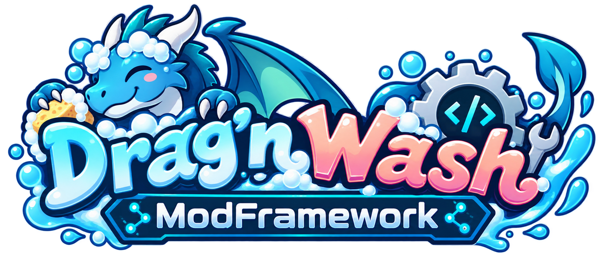

<p align="center"></p>

# Drag'n Wash ModFramework

[日本語](README.ja.md)

A prerequisite mod for [Drag'n Wash](https://store.steampowered.com/app/4739660/) (BepInEx 5). It is a small core that keeps the code hooking into the game in one place and gives other mods, and libraries built on top of it, a stable API: a Mods screen reached from the game's Options screen (like Minecraft Forge's mod list, with on/off switches), settings in the game's Options screen, text and dialogue events, safe asset loading on Direct3D 12, and more. When the game updates, only the framework has to follow.

> [!NOTE]
> **Core 1.1.0** (the libraries are at 1.0.0) adds [update notices](#update-notices). 1.0.0 was released together with [Drag'n Wash Localization](https://github.com/TomXV/dragnwash-localization) v1.0.0, the first mod built on it. From 1.0.0 on, a change that breaks the public API comes only with a new major version; see [CHANGELOG.md](CHANGELOG.md).

See [docs/DESIGN.md](docs/DESIGN.md) for goals and the order of work, [docs/GUIDE.md](docs/GUIDE.md) for how to build a mod on it, and [docs/GAME_BUILDS.md](docs/GAME_BUILDS.md) for the game builds it was checked on. The [wiki](https://github.com/TomXV/dragnwash-modframework/wiki) has a page for players, a getting-started walkthrough and a reference page for each library.

## What is in it

| Plugin | GUID | What mods get |
|---|---|---|
| **Drag'n Wash ModFramework** (core) | `com.tomxv.dragnwash.modframework` | The Mods screen with on/off switches, settings pages and icons (`ModFramework.Register`), rows in the game's Options screen (`GameOptions`), a service registry (`Services`), health checks (`GameHooks`), `GameInfo` |
| **Text** | `com.tomxv.dragnwash.modframework.text` | See and replace every text before the game shows it (`GameText`) |
| **Dialogue** | `com.tomxv.dragnwash.modframework.dialogue` | The line of dialogue or option about to be shown, with line ID, speaker and node (`GameDialogue`) |
| **Tool window** | `com.tomxv.dragnwash.modframework.toolwindow` | One shared F1 window for developer tools, where each mod adds tabs (`ToolWindow`) |
| **Assets** | `com.tomxv.dragnwash.modframework.assets` | Fonts for any language and texture and asset bundle loading, without the Direct3D 12 crash (`GameFonts`, `GameAssets`) |
| **Flags and saves** | `com.tomxv.dragnwash.modframework.saves` | Save slots, flags and a history of every save (`GameSaves`, `GameFlags`) |

Each library is its own plugin with its own version; install the ones the mods you use need. See [CHANGELOG.md](CHANGELOG.md) for versions.

### Update notices

From core 1.1.0, the framework tells you on the Mods screen and the title screen when a mod you have installed has a newer release. Only mods that name their GitHub repository are checked, each at most once a day. The framework asks GitHub's public API (`api.github.com`) for the repository's latest release and sends nothing about you, your game or your other mods; GitHub sees your IP address, as with any web page. Nothing is downloaded or installed: the Mods screen opens the release page for you. To switch it off, open **Options → Mods → Drag'n Wash ModFramework → Settings** and set **Check for updates** to Off, or set `Check for updates = false` in `BepInEx/config/com.tomxv.dragnwash.modframework.cfg`.

## For mod developers

Reference `DragNWash.ModFramework.dll` (and the library DLLs you use) and declare each dependency so BepInEx loads them first. [docs/GUIDE.md](docs/GUIDE.md) has what to use for what, and the rules that keep mods working together. To give players a one-click install, ship the shared installer with a `mod-install.json`: [docs/INSTALLER.md](docs/INSTALLER.md).

```csharp
[BepInPlugin("com.example.mymod", "MyMod", "1.0.0")]
[BepInDependency(ModFramework.Guid, BepInDependency.DependencyFlags.HardDependency)]
public class MyMod : BaseUnityPlugin
{
    private void Awake()
    {
        ModFramework.Ready += () =>
        {
            if (GameInfo.IsDirect3D12)
            {
                // Load fonts and textures now, not later.
            }
        };
    }
}
```

## Building

1. Install the .NET SDK and have BepInEx 5.4.23.5 installed in the game.
2. Copy the reference assemblies from your own game install (they are never committed):

   ```bash
   pwsh tools/copy-libs.ps1
   ```

   Pass `-GamePath` if the game is not in the default Steam library.
3. Build the core, the preloader patcher and the libraries:

   ```bash
   dotnet build src/DragNWash.ModFramework/DragNWash.ModFramework.csproj -c Release
   ```

   and the same for each `src/DragNWash.ModFramework.*` project.

Each DLL goes to its project's `bin/Release/`. To try them, copy each plugin DLL to its own folder, `<Game>/BepInEx/plugins/<assembly name>/`, and `DragNWash.ModFramework.Preloader.dll` to `<Game>/BepInEx/patchers/`.

## Rules for this repository

- Never commit the game's files, BepInEx binaries or anything from `libs/`. A check on every push and pull request enforces it.
- Code that touches game classes stays `internal`; mods only see the framework's own types.

## A note to the developers

This is an unofficial fan project and is not affiliated with Gator Dragon Games. It contains no game assets or code and does not modify the game's files (BepInEx loads it at runtime). If the development team has any concerns, please open an issue or contact the maintainer, and it will be changed or taken down.

## License

[MIT](LICENSE)
